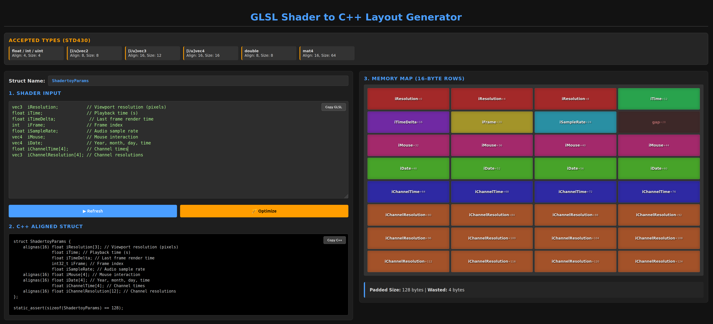

# GLSL Shader-to-C++ Layout Generator (`std430`)

** Entirely AI generated, I didn't really checked the generated HTML/Javascript code, seems to work fine so far.**

A lightweight, single-page tool to bridge the gap between **GLSL shader types** and **C++17 structures**. This tool automates the "magic" of GPU memory alignment, specifically for Vulkan push constants and SSBOs.

**🔗 Live Tool:** [mojocorp.github.io/glsl-to-cpp-layout-generator/](https://mojocorp.github.io/glsl-to-cpp-layout-generator/)

## 📸 Preview

## 🚀 The Problem
GPU memory layouts like `std430` follow strict alignment rules. For example, a `vec3` takes 12 bytes but requires a **16-byte alignment**. Manually calculating offsets and adding `alignas()` keywords or padding variables in C++ is tedious and often leads to silent memory corruption.

## ✨ Features
*   **Instant Visualization**: Color-coded memory map showing exactly how your data sits in 16-byte rows.
*   **Alignment Optimization**: One-click **🪄 Optimize** to eliminate "wasted" (padding) space by sorting members by alignment requirements.
*   **C++17 Generation**: Produces clean C++ structs using `alignas` and `static_assert` for size verification.
*   **Vulkan Safety Check**: Automatic warning if your total struct size exceeds the standard **128-byte limit**.

## 🛠 Supported Types

| Shader Type | C++ Type | Alignment | Size (Bytes) |
| :--- | :--- | :--- | :--- |
| `float`, `int`, `uint` | `float`, `int32_t`, `uint32_t` | 4 | 4 |
| `[i/u]vec2` | `float`, `int32_t`, `uint32_t` | 8 | 8 |
| `[i/u]vec3` | `float`, `int32_t`, `uint32_t` | **16** | 12 |
| `[i/u]vec4` | `float`, `int32_t`, `uint32_t` | 16 | 16 |
| `dvec2` | `double` | 16 | 16 |
| `dvec3` | `double` | 32 | 24 |
| `dvec4` | `double` | 32 | 32 |
| `double` | `double` | 8 | 8 |
| `mat3` | `float` | 16	| 48 |
| `mat4` | `float` | 16 | 64 |

## 📖 How to Use
1.  **Paste** your shader uniform or push constant block into the **Shader Input** area.
2.  **Rename** your struct in the "Struct Name" field.
3.  (Optional) Click **🪄 Optimize** to automatically minimize memory waste.
4.  **Copy** the generated C++ code directly into your header files.

## ⚖️ License
Distributed under the MIT License.
